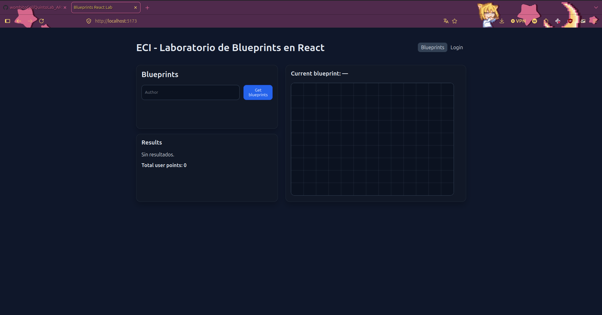
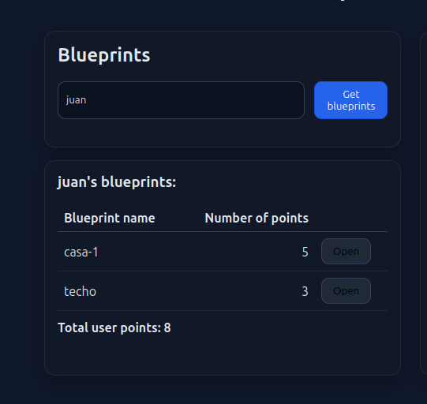
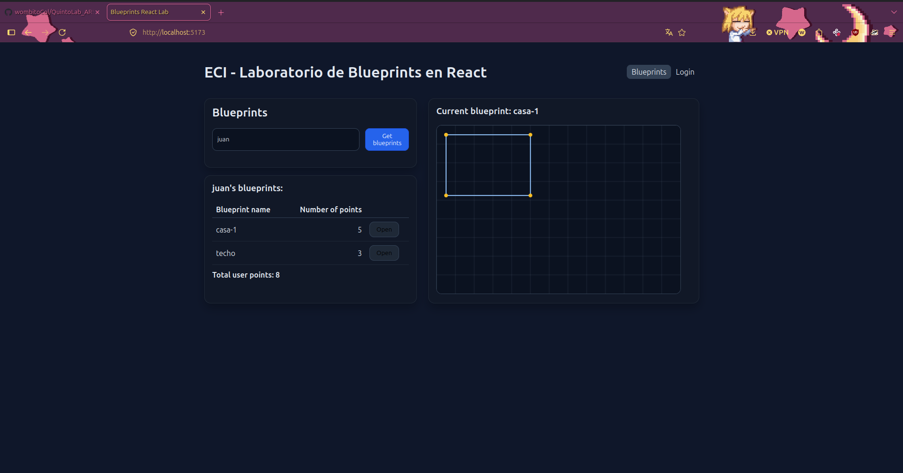
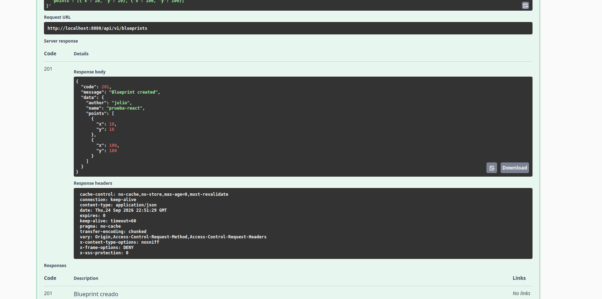
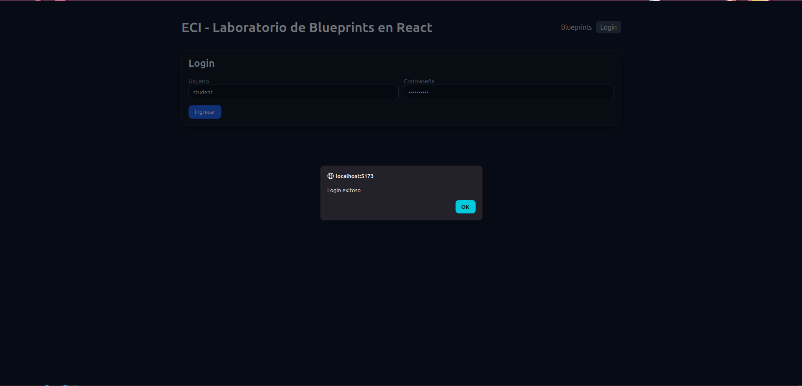
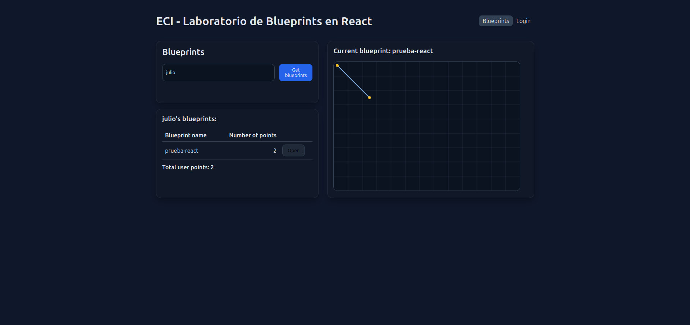

## Laboratorio 5
### Diego Patiño y Julio Mayorquin

### 1. Canvas

El componente `BlueprintCanvas` (`src/components/BlueprintCanvas.jsx`), con `id="blueprint-canvas"` propio y dimensiones por defecto `520×360`. Dibuja una grilla de fondo y, cuando recibe `points`, traza los segmentos consecutivos y marca cada punto con un círculo.

Conexion con el canva vacio. 

### 2. Listar los planos de un autor

En `BlueprintsPage.jsx`, el input de autor + botón **Get blueprints** despachan `fetchByAuthor`, que trae los planos y los muestra en una tabla con nombre, número de puntos y botón **Open**.

Listar autores mockeados

### 3. Seleccionar un plano y graficarlo

Al hacer clic en **Open**, se despacha `fetchBlueprint({author, name})`, que actualiza `current` en Redux. Eso hace que el título "Current blueprint: …" cambie y que `BlueprintCanvas` reciba los nuevos `points` y se redibuje.

Graficacion en canvas

### 4. Servicios `apimock` y `apiclient`

Se implementó la capa de servicios con interfaz común (`getAll`, `getByAuthor`, `getByAuthorAndName`, `create`):

- `src/services/apiclient.js` — consume el backend real vía Axios (usa `httpClient.js`, que trae los interceptores JWT).
- `src/services/apimock.js` — devuelve datos de prueba en memoria, simulando latencia de red.
- `src/services/blueprintsService.js` — decide cuál de los dos exportar según `VITE_USE_MOCK` en `.env`.

El resto de la app (`blueprintsSlice.js`) solo importa `blueprintsService`, sin saber si está hablando con el mock o con el backend real — el cambio es de una sola línea en `.env`.

Cabe aclarar que:
Al backend (Lab 4) le agregamos configuración de CORS en SecurityConfig.java — dos líneas nuevas (.cors(Customizer.withDefaults()) en la cadena de seguridad y un bean CorsConfigurationSource que autoriza explícitamente al origen http://localhost:5173). 

Creacion de blueprints julio.

Login backend exitoso.

Get de los blueprints, funcion open y graficacion correcta. 
<!-- Pega aquí tus capturas, por ejemplo:

-->
